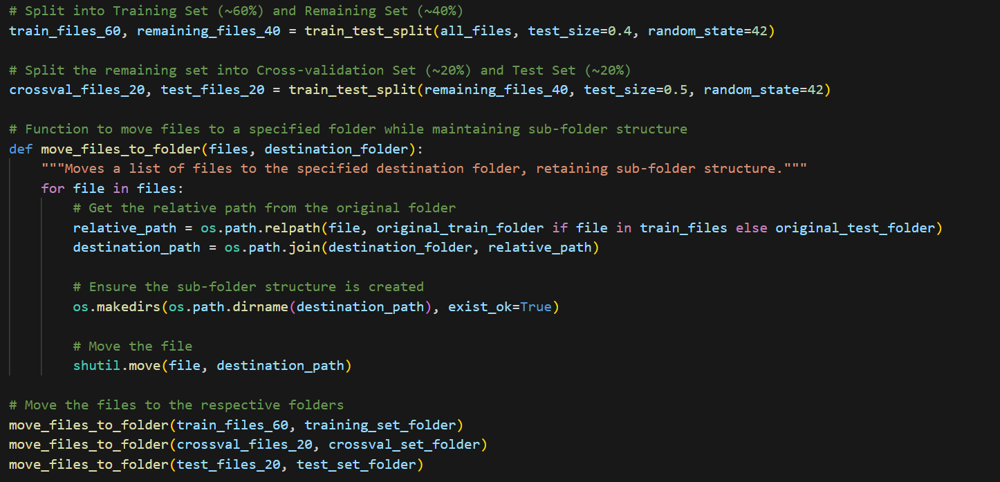
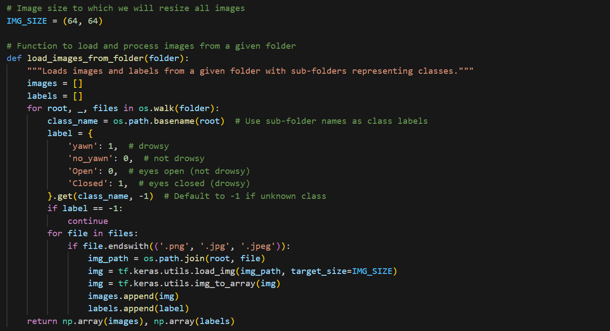
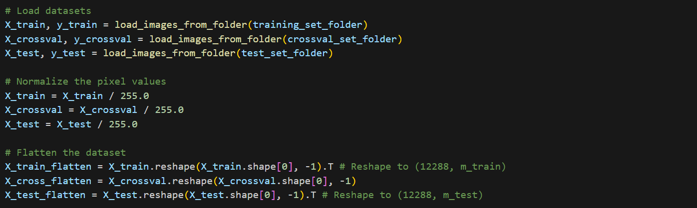

# 📌 Project Background  
Driver drowsiness detection is a type of technology used in vehicles that helps detect driver drowsiness. These systems help prevent fatigue-related accidents. Various technologies, such as steering pattern monitoring, vehicle position in lane monitoring, and driver face monitoring, are being used. This project aims to find the best deep learning model to detect drowsiness given an image [dataset](https://www.kaggle.com/datasets/serenaraju/yawn-eye-dataset-new).

<i>In collaboration with Anurag Ramesh Patil, Bijay Gautam, Justin Gamoras, Shri Hari Sekar, and Suyog Sanklapur.</i>

# 🧐 Data Overview  
This dataset contains 2900 images, each in one of the following categories:  
- eye opened
- eye closed
- person yawning
- person not yawning  

The outcome variable is binary (1 for drowsy and 0 for non-drowsy). Images in the "eye opened" or "person not yawning" groups are considered non-drowsy, whereas images in the "eye closed" or "person yawning" groups are considered drowsy. 75% of the images in this dataset have an outcome of 1, or drowsy.  

# 🖥️ Data Processing  
To pre-process the data, we did data partitioning, image processing, and normalization. 
- Data partitioning to split the images into three datasets, 60% in training, 20% in cross-validation, and the remaining 20% in testing.  
   
    
     
  This resulted in 1740 images in the training set and 580 images in each of the cross-validation and testing sets.   
- Image processing to resize each of the images to 64 pixels x 64 pixels and to add the 0 and 1 labels to the images.  
   
    
     
- Normalizing the images by scaling the features to be between 0 and 1, making the data more interpretable.  
   
    
     
